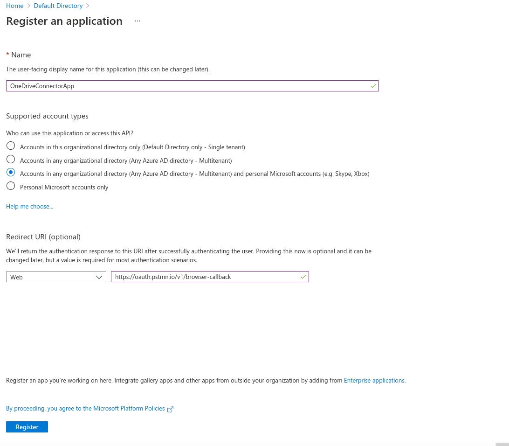
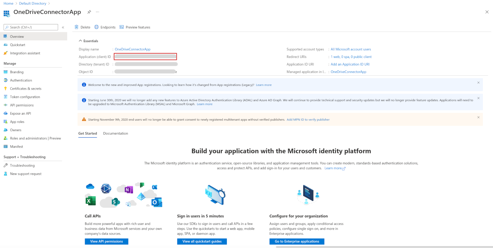
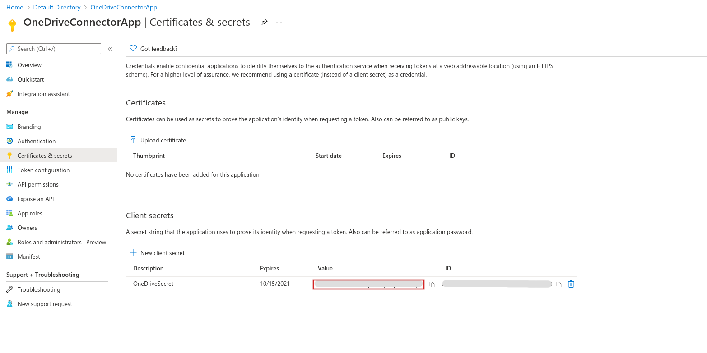
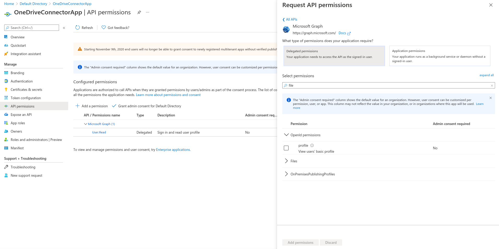
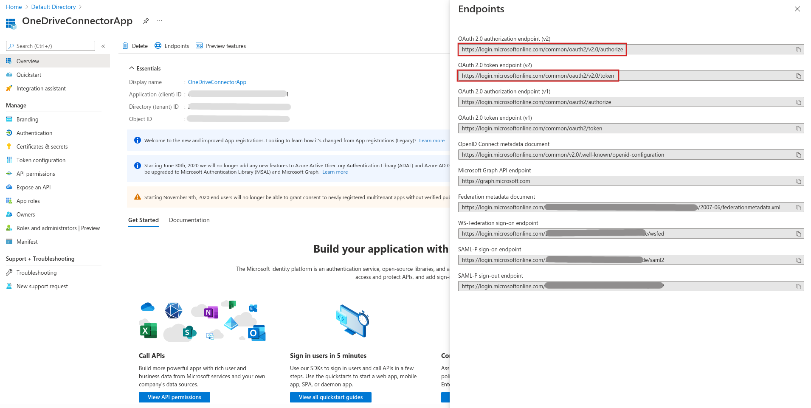

Ballerina Connector for Microsoft OneDrive
===================

[](https://github.com/ballerina-platform/module-ballerinax-msgraph-onedrive/actions?query=workflow%3ACI)
[](https://github.com/ballerina-platform/module-ballerinax-msgraph-onedrive/commits/master)
[](https://opensource.org/licenses/Apache-2.0)

Connects to Microsoft OneDrive using Ballerina.

- [Microsoft OneDrive connector](#)
    - [Introduction](#introduction)
        - [What is Microsoft OneDrive](#what-is-microsoft-onedrive)
        - [Key features of Microsoft OneDrive](#key-features-of-microsoft-onedrive)
        - [Connector overview](#connector-overview)
        - [Compatibility and limitations](#compatibility-and-limitations)
    - [Prerequisites](#prerequisites)
    - [Configure the connector](#configure-the-connector)
        - [Obtain tokens](#obtain-tokens)
        - [Add the project configuration file](#add-the-project-configuration-file)
    - [Quickstart](#quickstart)
    - [Samples](#samples)
    - [Build from the source](#build-from-the-source)
    - [Contribute to Ballerina](#contribute-to-ballerina)
    - [Code of conduct](#code-of-conduct)
    - [Useful links](#useful-links)

# Introduction
## What is Microsoft OneDrive?
[Microsoft OneDrive](https://www.microsoft.com/en-us/microsoft-365/onedrive/online-cloud-storage) is a file hosting 
service and synchronization service operated by Microsoft as part of its web version of Office. It provides 5 GB of space for free to anyone with a Microsoft account. OneDrive’s starter tier allows storage, document editing, and collaboration via Office Online. For Windows 10 users, OneDrive is embedded in the operating system by default.<br/>  
OneDrive allows you to save files, photos, and other documents across multiple devices. You can also save your files in OneDrive and have them automatically sync to other devices, which means someone can access and work on the same document in multiple locations. OneDrive provides relatively easy access to cloud storage space, allowing options to share content with others. OneDrive integrates with Microsoft Office so that you can access Word, Excel, and Powerpoint documents from OneDrive. It does not require a download because it is already a part of Windows 10. 

<p align="center">

</p>

## Key features of Microsoft OneDrive
- Unlimited file access at anytime.  
- Capability to render individual and shared work files from anywhere for collaboration.
- File organization.  
- Support to free-up device storage.  
- Capability to share content across teams, large or small.  
- Customizable sync experience (for admins). 
- Secure storage of files and information.  
- Multimedia support. 
- Tight integration with other Microsoft products (including Microsoft 365).  

## Connector overview
Ballerina connector for Microsoft OneDrive connects to the OneDrive file storage API in Microsoft Graph v1.0 via Ballerina language. The connector allows you to programmatically perform basic drive functionalities such as file upload, download. It also allows you to share files and folders stored on Microsoft OneDrive.<br/>
The connector is developed on top of Microsoft Graph API, which is a REST API that empowers you to access Microsoft Cloud service resources. This version of the connector only supports access to resources and information corresponding to a specific Microsoft account (currently, it is the signed-in user account).

# Compatibility and limitations
## Compatibility
- Ballerina language version: Swan Lake Beta 1
- [Microsoft Graph API](https://docs.microsoft.com/en-us/graph/overview) version: 1.0 


## Limitations
- Allows performing functions only on behalf of the currently signed-in user.
- Only supports access to operations available in the corresponding personal Microsoft account.

# Prerequisites
- A Microsoft OneDrive account
- An Azure account that has an active subscription (you can use your persona, work, or school account)
- Java Development Kit (JDK) 11 installed
- [Ballerina SL Beta 1](https://ballerina.io/learn/user-guide/getting-started/setting-up-ballerina/installation-options/) installed

# Configure the connector
## Obtain tokens

To use the connector, you need an access token with information about your application and its permission to access resources and APIs available through Microsoft Graph.<br/> 
To get an access token, you must register your application with the Microsoft identity platform and get it authorized by either a user or an administrator to access the Microsoft Graph resources it needs.<br/>
For your application to get a token from the Microsoft identity platform, you must register it in the Azure portal. Registration integrates your application with the Microsoft identity platform to establish a trust relationship to get the following details:
- Application ID
- Redirect URL
- Application Secret

Follow these steps to register your application and get the required details:

**Step 1:** Register a new application in your Azure AD tenant

Follow this procedure to register your application and get the Application (client) ID:

   1. On the Application registrations page, click **New registration** and enter an appropriate display name for your application.
   2. In the **Supported account types** section, select **Accounts in any organizational directory (Any Azure AD directory - Multi-tenant) and personal Microsoft accounts (e.g., Skype, Xbox, Outlook.com)** or **Personal Microsoft accounts only**. 
   3. Provide a **Redirect URI** if necessary.
   4. Click **Register**. 

       
   5. Copy the Application (client) ID to a text file to use as the value of `<MS_CLIENT_ID>`, which is the unique identifier for your application.

       

**Step 2:** Create a new client secret

Follow this procedure to get the client secret for your application:

   1. Under **Manage**, click **Certificates & secrets**.
   2. In the **Client secrets** section, click **New client secret**.
   3. Enter an appropriate description and expiration date for the new client secret.
   4. Click **Add**.
   5. Copy the client secret to a text file to use as the value of `<MS_CLIENT_SECRET>`.

       

**Step 3:** Add scopes and permission

In an OpenID Connect or OAuth 2.0 authorization request, an application can request necessary permission using the scope query parameter. When it comes to Microsoft resources, some of the high-privilege admin-restricted permissions require an organization's administrator consent on behalf of organization users.<br/>
If you require such permission, be sure to request and get the appropriate permission.
   
  


**Step 4:** Obtain the access token and refresh token

Follow this procedure to get the access token, and refresh token:

   1. In the Overview of the application, click the **Endpoints** tab to view its authorization endpoint and token endpoint.
   2. Copy the **OAuth 2.0 token endpoint (v2)** value to a text file to use as the value of `<MS_REFRESH_URL>`.

       

   3. In a new browser, enter the URL as follows and replace `<MS_CLIENT_ID>` with the application ID you obtained in Step 1.

       ```
       https://login.microsoftonline.com/common/oauth2/v2.0/authorize?client_id=<MS_CLIENT_ID>&response_type=code&redirect_uri=https://oauth.pstmn.io/v1/browser-callback&response_mode=query&scope=openid offline_access <SPACE_SEPERATED_LIST_OF_SCOPES>
       ```
    
      This prompts for the username and password to sign in to the Azure Portal application.

   4. Enter the username and password. This takes you to a URL as follows:
        ```
        https://login.microsoftonline.com/common/oauth2/nativeclient?code=M95780001-0fb3-d138-6aa2-0be59d402f32
        ```
   5. Copy the code parameter (here it is M95780001-0fb3-d138-6aa2-0be59d402f32) to a text file to use as the value of `<MS_REFRESH_URL>` in the project configuration file.
   6. In a new terminal enter the following cURL command: 
      **Note**: Be sure to replace <MS_CODE>, <MS_CLIENT_ID>, and <MS_CLIENT_SECRET> with appropriate values you obtained in the steps above.
        ```
        curl -X POST --header "Content-Type: application/x-www-form-urlencoded" --header "Host:login.microsoftonline.com" -d "client_id=<MS_CLIENT_ID>&client_secret=<MS_CLIENT_SECRET>&grant_type=authorization_code&redirect_uri=https://login.microsoftonline.com/common/oauth2/nativeclient&code=<MS_CODE>&scope=Files.ReadWrite openid User.Read Mail.Send Mail.ReadWrite offline_access" https://login.microsoftonline.com/common/oauth2/v2.0/token
        ```
        
     The cURL command results in a response as follows with the values for `<MS_ACCESS_TOKEN>` and `<MS_REFRESH_TOKEN>`:
        ```
        {
            "token_type": "Bearer",
            "scope": "openid <LIST_OF_PERMISSIONS>",
            "expires_in": 3600,
            "ext_expires_in": 3600,
            "access_token": "<MS_ACCESS_TOKEN>",
            "refresh_token": "<MS_REFRESH_TOKEN>",
            "id_token": "<ID_TOKEN>"
        }
        ```
        Copy the values of `<MS_ACCESS_TOKEN>` and `<MS_REFRESH_TOKEN> to a text file to use in the project configuration file.
        
For more information on OAuth2 tokens, see [Register an application with the Microsoft identity platform](https://docs.microsoft.com/en-us/graph/auth-register-app-v2) and [OAuth 2.0 and OpenID Connect protocols on the Microsoft identity platform](https://docs.microsoft.com/en-au/azure/active-directory/develop/active-directory-v2-protocols#endpoints)<br/>

## Add the project configuration file

Follow this procedure:

1. Create a file named `config.toml` under the root path of the project structure.
2. Add the following configuration to the file:
  **Note**: Replace the placeholders with appropriate values you obtained by following the steps under [Obtain tokens](#obtain-tokens).


#### config.toml
```ballerina
[ballerinax.microsoft.onedrive]
refreshUrl = <MS_REFRESH_URL>
refreshToken = <MS_REFRESH_TOKEN>
clientId = <MS_CLIENT_ID>
clientSecret = <MS_CLIENT_SECRET>
scopes = [<MS_NECESSARY_SCOPES>]
```

# Quickstart

This section walks you through step-by-step instructions on how you can use the connector to perform various actions.

## Create a folder in OneDrive
### Step 1: Import the OneDrive package
Import the `ballerinax/microsoft.onedrive` module into the Ballerina project.
```ballerina
import ballerinax/microsoft.onedrive;
```
### Step 2: Configure a connection to an existing Azure AD application
To make the connection, use the OAuth2 refresh token grant configuration as follows:
```ballerina
onedrive:Configuration configuration = {
    clientConfig: {
        refreshUrl: <REFRESH_URL>,
        refreshToken : <REFRESH_TOKEN>,
        clientId : <CLIENT_ID>,
        clientSecret : <CLIENT_SECRET>,
        scopes: [<NECESSARY_SCOPES>]
    }
};
```
### Step 3: Create a folder
To create a folder, use the following code block:

```string parentID = "<PARENT_FOLDER_ID>";
    string newFolderName = "Samples_Test";
    onedrive:FolderMetadata item = {
        name: newFolderName,
        conflictResolutionBehaviour : "rename"
    };

    onedrive:DriveItemData|onedrive:Error driveItem = driveClient->createFolderById(parentID, item);

    if (driveItem is onedrive:DriveItemData) {
        log:printInfo("Folder Created " + driveItem.toString());
        log:printInfo("Success!");
    } else {
        log:printError(driveItem.message());
    }
```

## Upload a file to OneDrive
### Step 1: Import the OneDrive package
Import the `ballerinax/microsoft.onedrive` module into the Ballerina project.
```ballerina
import ballerinax/microsoft.onedrive;
```
### Step 2: Configure the connection to an existing Azure AD application
To make the connection, use the OAuth2 refresh token grant configuration as follows:
```ballerina
onedrive:Configuration configuration = {
    clientConfig: {
        refreshUrl: <REFRESH_URL>,
        refreshToken : <REFRESH_TOKEN>,
        clientId : <CLIENT_ID>,
        clientSecret : <CLIENT_SECRET>,
        scopes: [<NECESSARY_SCOPES>]
    }
};
```
### Step 3: Create a OneDrive client
To create a OneDrive client, use the following line of code:
```ballerina
onedrive:Client driveClient = check new (config);
```
### Step 4: Upload a file
To upload a file, use the following code block:
```ballerina
    byte[] byteArray = check io:fileReadBytes("<LOCAL_FILE_PATH>");
    string fileNameNewForNewUploadByPath = "<NEW_FILE_NAME>";
    string parentFolderPath = "<PARENT_FOLDER_PATH>";
    string mediaType = "image/png";

    onedrive:DriveItemData|onedrive:Error itemInfo = driveClient->uploadFileToFolderByPath(parentFolderPath, 
        fileNameNewForNewUploadByPath, byteArray, mediaType);
    if (itemInfo is onedrive:DriveItemData) {
        log:printInfo("Uploaded item " + itemInfo?.id.toString());
        log:printInfo("Success!");
    } else {
        log:printError(itemInfo.message());
    }
```

## Download a file from OneDrive
### Step 1: Import the OneDrive package
Import the `ballerinax/microsoft.onedrive` module into the Ballerina project.
```ballerina
import ballerinax/microsoft.onedrive;
```
### Step 2: Configure the connection to an existing Azure AD application
To make the connection, use the OAuth2 refresh token grant configuration as follows:
```ballerina
onedrive:Configuration configuration = {
    clientConfig: {
        refreshUrl: <REFRESH_URL>,
        refreshToken : <REFRESH_TOKEN>,
        clientId : <CLIENT_ID>,
        clientSecret : <CLIENT_SECRET>,
        scopes: [<NECESSARY_SCOPES>]
    }
};
```
### Step 3: Create a OneDrive client
To create a OneDrive client, use the following line of code:
```ballerina
onedrive:Client driveClient = check new (config);
```
### Step 4: Download a file
To download a file, use the following code block:
```ballerina
    string filePath = "<PATH_FILE_TO_BE_DOWNLOADED>";
    
    onedrive:File|onedrive:Error itemResponse = driveClient->downloadFileByPath(filePath);
    if (itemResponse is onedrive:File) {
        byte[] content = let var item = itemResponse?.content in item is byte[] ? item : [];
        io:Error? result = io:fileWriteBytes("./files/downloadedFile", content);
        log:printInfo("Success!");
    } else {
        log:printError(itemResponse.message());
    }
```

# Samples
This section walks you through the operations you can perform with the connector.

## Get `DriveItem` metadata
Retrieves metadata for a `DriveItem` in a drive using the item ID or file system path (relative path). 

- [ID-based addressing sample](/onedrive/samples/get_item_metadata_by_id.bal)

- [Path-based addressing sample](/onedrive/samples/get_item_metadata_by_path.bal)

**Note:** <br/>
This operation supports several OData query parameters and normal query parameters.
* **$expand** 
* **$select**
* **includeDeletedItems=true**: Query parameter to return deleted items. This query parameter is only valid if you want to 
target a `DriveItem` by ID.

- [Sample with query parameters](/onedrive/samples/get_item_metadata_by_id_query_params.bal)

## Get recent `DriveItems`
Lists a set of items that a signed-in user used recently, such as items in the signed-in user's drive and items accessed from other user drives.

- [Sample](/onedrive/samples/get_recent_items.bal)

## Get `DriveItems` shared with me
Retrieves a collection of `DriveItem` resources shared with the signed-in user of OneDrive.

- [Sample](/onedrive/samples/get_shared_items.bal)

## Create a new folder in OneDrive
Creates a new folder in a drive with a specified parent item using the parent folder ID or file system path 
(relative path).

- [ID-based addressing sample](/onedrive/samples/create_folder_by_id.bal)

- [Path-based addressing sample](/onedrive/samples/create_folder_by_path.bal)

## Update a `DriveItem`
Updates metadata for a `DriveItem` in a drive using the item ID or file system path (relative path).

- [ID-based addressing sample](/onedrive/samples/update_drive_item_by_id.bal)

- [Path-based addressing sample](/onedrive/samples/update_drive_item_by_path.bal)

**Note:** <br/>
* Item update does not work when an item is open in a browser (i.e., the item is in edit view). For more information, see [the discussion on Stack Overflow](https://stackoverflow.com/questions/50057662/not-able-to-update-file-stream-through-microsoft-graph-sdk-when-file-is-open-in)

* The set of exact fields that can be updated is not provided in the docs. 
If you try to update facets that are not related to the current resource (i.e., if the resource is a file and you send 
a folder facet), an error occurs.

## Delete a `DriveItem`
Deletes a `DriveItem` in a drive using its item ID or file system path (relative path).

- [ID-based addressing sample](/onedrive/samples/delete_drive_item.by_id.bal)

- [Path-based addressing sample](/onedrive/samples/delete_drive_item.by_path.bal)

## Restore a `DriveItem`
Restores a `DriveItem` that has been deleted and is currently in the recycle bin.

- [Sample](/onedrive/samples/restore_drive_item.bal)

## Copy a `DriveItem`
Asynchronously creates a copy of a `DriveItem` (including any children) under a new parent item or at the same location 
with a new name.

- [ID-based addressing sample](/onedrive/samples/copy_drive_item_by_id.bal)

- [Path-based addressing sample](/onedrive/samples/copy_drive_item_by_path.bal)

## Download a file
Downloads content of the primary stream (file) of a `DriveItem` using item ID or its file system path (relative path). 

- [ID-based addressing sample](/onedrive/samples/download_file_by_id.bal)

- [Path-based addressing sample](/onedrive/samples/download_file_by_path.bal)

**Note:** <br/> 
* You can only download `DriveItems` that have the file property.

## Upload a small file to a specific location in OneDrive
Upload a new file to the Drive.

- [ID-based addressing sample](/onedrive/samples/upload_file_to_parent_id.bal)

- [Path-based addressing sample](/onedrive/samples/upload_file_to_parent_path.bal)

**Note:** <br/>
* The maximum file size allowed for upload is 4MB.

## Replace a file
Updates contents of an existing file in the drive.

- [ID-based addressing sample](/onedrive/samples/replace_file_using_id.bal)

- [Path-based addressing sample](/onedrive/samples/replace_file_using_path.bal)

**Note:** <br/>
* The file used for replacing must be of the same media type as the file it replaces.
* The maximum file size allowed is 4MB.

## Upload a large file to a specific location in OneDrive
Uploads files up to the maximum file size. 

- [Sample](/onedrive/samples/upload_large_file.bal)

**Note:** <br/> 
* Maximum bytes in a request should be less than 60 MiB.
* If the file is fragmented into multiple byte ranges, the size of each byte range MUST be a multiple of 320 KiB 
(327,680 bytes). You can use the `ondedrive:DEFAULT_FRAGMENT_SIZE` constant to easily obtain a multiple of 320 KiB.

## Search for `DriveItems`
Performs a search on the hierarchy of items based on the search query. You can search within a folder hierarchy, a whole drive, or 
files shared with the current user.

- [Sample](/onedrive/samples/search_drive_items.bal)

**Note:** <br/>
* Supports **$expand**, **$select**, **$skipToken**, **$top**, and **$orderby** OData query parameters to customize 
the response.
* You can use the **$top** query parameter to specify the number of items on the page.
* For more information on Odata query parameters, see [Using query parameters to change the shape of a response](https://docs.microsoft.com/en-us/onedrive/developer/rest-api/concepts/optional-query-parameters?view=odsp-graph-online)

## Get a sharable link for a `DriveItem`
Creates a new sharable link if the specified link type doesn't already exist for the calling application. If a sharable 
link of the specified type already exists for the application, the existing sharable link is returned.

- [ID-based addressing sample](/onedrive/samples/get_sharable_link_from_id.bal)

- [Path-based addressing sample](/onedrive/samples/get_sharable_link_from_path.bal)

## Get metadata for a shared `DriveItem`
Accesses a shared `DriveItem` using the shared URL.

- [Sample](/onedrive/samples/get_shared_drive_item.bal)

## Send a sharing invitation via email for a `DriveItem`
Sends a sharing invitation for a `DriveItem`. A sharing invitation provides permission to recipients and optionally 
sends them an email with a link to access the shared `DriveItem`.

- [ID-based addressing sample](/onedrive/samples/send_sharing_invitation_by_id.bal)

- [Path-based addressing sample](/onedrive/samples/send_sharing_invitation_by_path.bal)

**Note:** <br/>
* OneDrive personal accounts cannot create or modify permission on the root `DriveItem`.

# Build from the source
## Prerequisites

1. Download and install Java SE Development Kit (JDK) version 11 from one of the following locations:

   * [Oracle](https://www.oracle.com/java/technologies/javase-jdk11-downloads.html)

   * [OpenJDK](https://adoptopenjdk.net/)

        > **Note:** Set the JAVA_HOME environment variable to the pathname of the directory where you installed the JDK.

2. Download and install [Ballerina SLBeta 1](https://ballerina.io/). 

## Build the source
Execute the commands below to build from the source after installing Ballerina SL Beta 1 version.

1. To build the library:
```shell script
    bal build
```

2. To build the module without the tests:
```shell script
    ball build --skip-tests
```
# Contribute to Ballerina
As an open-source project, Ballerina welcomes contributions from the community. 

For more information, go to the [contribution guidelines](https://github.com/ballerina-platform/ballerina-lang/blob/main/CONTRIBUTING.md).

# Code of conduct
All contributors are encouraged to read the [Ballerina code of conduct](https://ballerina.io/code-of-conduct).

# Useful links
* Discuss code changes of the Ballerina project in [ballerina-dev@googlegroups.com](mailto:ballerina-dev@googlegroups.com).
* Reach out to us via our [Slack channel](https://ballerina.io/community/slack/).
* Post all technical questions on Stack Overflow with the [#ballerina](https://stackoverflow.com/questions/tagged/ballerina) tag.
