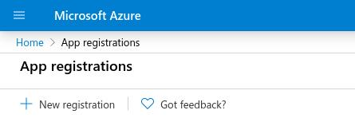
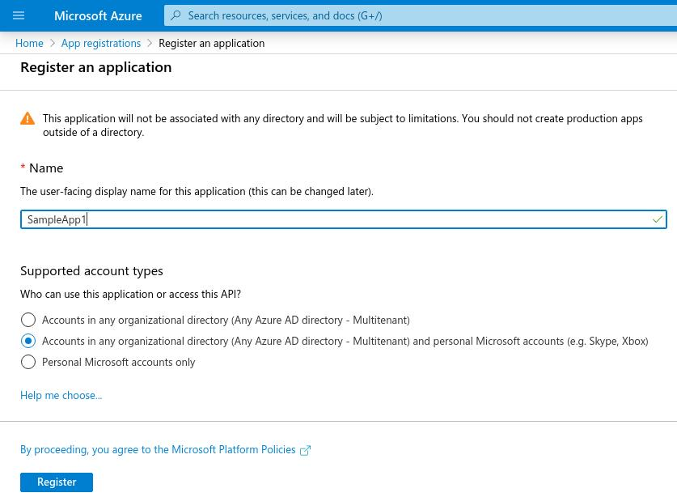
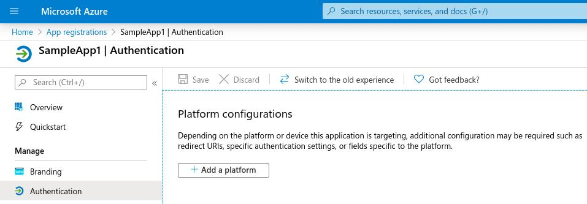
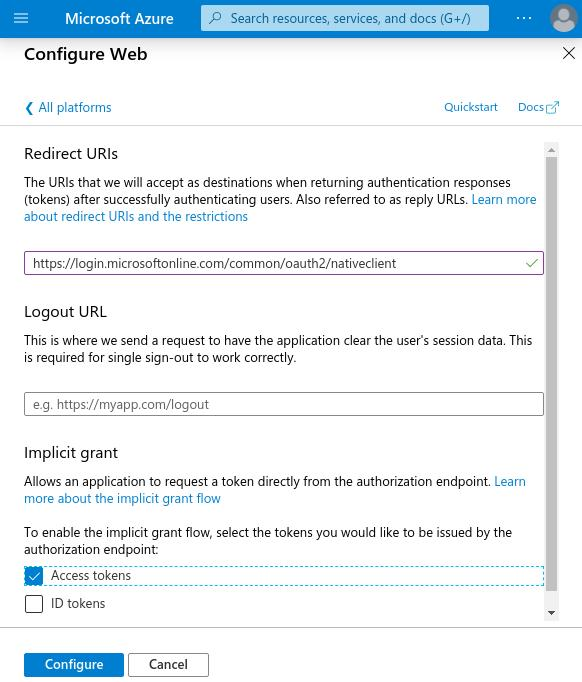

# Module Microsoft OneDrive

The `ballerinax/module-ballerinax-microsoft.onedrive` module contains operations to connect to Microsoft OneDrive and provides information on the files, which have been stored on [Microsoft OneDrive](https://docs.microsoft.com/en-us/graph/onedrive-concept-overview).

## Compatibility
|                     |    Version     |
|:-------------------:|:--------------:|
| Ballerina Language  | Swan Lake Preview1   |
| Microsoftgraph REST API | v1.0          |

## Getting started

1.  Download and install Ballerina. For instructions, go to [Installing Ballerina](https://ballerina.io/learn/installing-ballerina/).

2.  Provide the following configuration information in the `ballerina.conf` file to use the Microsoft Graph API.

       - MS_CLIENT_ID
       - MS_CLIENT_SECRET
       - MS_ACCESS_TOKEN
       - MS_REFRESH_TOKEN
       - MS_FOLLOW_REDIRECTS
       - MS_MAX_REDIRECTS

    Follow the steps below to obtain the configuration information mentioned above. Note that `<MS_FOLLOW_REDIRECTS>` indicates whether the redirect
    response should be followed. `<MS_MAX_REDIRECTS>` indicates the maximum number of redirects to follow.

    1. Before you run the following steps, create an account in [OneDrive](https://onedrive.live.com). Next, sign into [Azure Portal - App Registrations](https://portal.azure.com/#blade/Microsoft_AAD_RegisteredApps/ApplicationsListBlade). You can use your personal, work, or school account to register.

    2. In the App registrations page, click **New registration** and enter a meaningful name in the name field.

    

    3. In the Supported account types section, select **Accounts in any organizational directory (Any Azure AD directory - Multitenant) and personal Microsoft accounts (e.g., Skype, Xbox, Outlook.com)**. Click **Register** to create the application.

    

    4. Copy the Application (client) ID (\<MS_CLIENT_ID>). This is the unique identifier for your app.
    
    5. In the application's list of pages (under the **Manage** tab in left hand side menu), select **Authentication**.
    Under **Platform configurations**, click **Add a platform**.

    

    6. Under **Configure platforms**, click the **Web** located under **Web applications**.

    7. Under the **Redirect URIs text box**, select the [OAuth2 Native Client](https://login.microsoftonline.com/common/oauth2/nativeclient).
    Under **Implicit grant**, select **Access tokens**.
    Click on **Configure**.

    

    8. Under **Certificates & Secrets**, create a new client secret (`<MS_CLIENT_SECRET>`). This requires providing a description and a period of expiry. Next, click **Add**.

    9. Next, you need to obtain an access token and a refresh token to invoke the Microsoft Graph API.
    First, in a new browser, enter the below URL by replacing the `<MS_CLIENT_ID>` with the application ID.

    ```
    https://login.microsoftonline.com/common/oauth2/v2.0/authorize?response_type=code&client_id=<MS_CLIENT_ID>&redirect_uri=https://login.microsoftonline.com/common/oauth2/nativeclient&scope=Files.ReadWrite openid User.Read Mail.Send Mail.ReadWrite offline_access
    ```

    10. This will prompt you to enter the username and password for signing into the Azure Portal App.

    11. Once the username and password pair is successfully entered, this will give a URL as follows on the browser address bar.

    `https://login.microsoftonline.com/common/oauth2/nativeclient?code=M95780001-0fb3-d138-6aa2-0be59d402f32`

    12. Copy the code parameter (`M95780001-0fb3-d138-6aa2-0be59d402f32` in the above example) and in a new terminal, enter the following cURL command by replacing the `<MS_CODE>` with the code received from the above step. The `<MS_CLIENT_ID>` and `<MS_CLIENT_SECRET>` parameters are the same as above.

    ```
    curl -X POST --header "Content-Type: application/x-www-form-urlencoded" --header "Host:login.microsoftonline.com" -d "client_id=<MS_CLIENT_ID>&client_secret=<MS_CLIENT_SECRET>&grant_type=authorization_code&redirect_uri=https://login.microsoftonline.com/common/oauth2/nativeclient&code=<MS_CODE>&scope=Files.ReadWrite openid User.Read Mail.Send Mail.ReadWrite offline_access" https://login.microsoftonline.com/common/oauth2/v2.0/token
    ```

    The above cURL command should result in a response as follows.
    ```
    {
    "token_type": "Bearer",
    "scope": "Files.ReadWrite openid User.Read Mail.Send Mail.ReadWrite",
    "expires_in": 3600,
    "ext_expires_in": 3600,
    "access_token": "<MS_ACCESS_TOKEN>",
    "refresh_token": "<MS_REFRESH_TOKEN>",
    "id_token": "<ID_TOKEN>"
    }
    ```

    13. Set the path to your Ballerina distribution's trust store as the `<TURST_STORE_PATH>`. This is by default located in the following path.

    `$BALLERINA_HOME/distributions/ballerina-<BALLERINA_VERSION>/bre/security/ballerinaTruststore.p12`

    The default `TRUST_STORE_PASSWORD` is set to "ballerina".

3. Create a new Ballerina project by executing the command below.

	```shell
	<PROJECT_ROOT_DIRECTORY>$ ballerina new project_name
	<PROJECT_ROOT_DIRECTORY>$ cd project_name
	<PROJECT_ROOT_DIRECTORY>$ ballerina add module_name
	```

4. Import the Microsoft OneDrive connector to your Ballerina program as follows.

    `import ballerinax/microsoft.onedrive;`

    The following sample program accesses an item, which is already stored on Microsoft OneDrive. Prior to running this application, create a workbook on your Microsoft OneDrive account's root with the name "Book.xlsx". Make sure that you keep the `ballerina.conf` file with the above-mentioned configuration information before running the sample application. If a workbook with  the file name `Book.xlsx` doesn't exist in the root level of the Microsoft OneDrive account, the sample application will print `Failed to get the Excel workbook.` 

	```
    import ballerina/io;
    import ballerina/config;
    import ballerinax/microsoft.onedrive;
    import ballerina/stringutils;
    import ballerina/lang.'int as langint;

    // Create the Microsoft Graph Client configuration by reading the config file.
    onedrive:MicrosoftGraphConfiguration msGraphConfig = {
        baseUrl: config:getAsString("MS_BASE_URL"),
        msInitialAccessToken: config:getAsString("MS_ACCESS_TOKEN"),
        msClientId: config:getAsString("MS_CLIENT_ID"),
        msClientSecret: config:getAsString("MS_CLIENT_SECRET"),
        msRefreshToken: config:getAsString("MS_REFRESH_TOKEN"),
        msRefreshUrl: config:getAsString("MS_REFRESH_URL"),
        bearerToken: config:getAsString("MS_ACCESS_TOKEN"),
        followRedirects: config:getAsBoolean("MS_FOLLOW_REDIRECTS", false),
        maxRedirectsCount: config:getAsInt("MS_MAX_REDIRECTS", 0)
    };

    public function main() {

        onedrive:OneDriveClient oneDriveClient = new (msGraphConfig);
        
        onedrive:Item|error item = oneDriveClient->getItem("Book.xlsx");

        if (item is onedrive:Item) {
            io:println("Failed to get the Excel workbook.");
        } else {
            io:println(item.message());
        }
    }
	```
